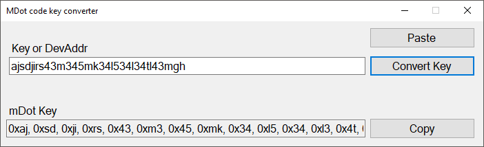

# MDotKeyFormatter

A small application written in C# to convert encryption keys generated by Dunedin IoT's LoRa Application server for node ABP application to the format used by the mDot's libmDot library on mbed.org, for easy copy/paste.

## Build

<a href="https://github.com/kellybs1/MDotKeyFormatter/blob/master/KeyFormatter/Build/KeyFormatterForMdot.exe?raw=true">KeyFormatterForMdot.exe</a>    

Note: You may need to unblock the executable: Right click the exe -> Properties, and in the bottom section click the Unblock checkbox and then click OK.

## Source

<a href="https://github.com/kellybs1/MDotKeyFormatter/tree/master/KeyFormatter/KeyFormatterForMdot">KeyFormatterForMdot</a>

## Screenshot

